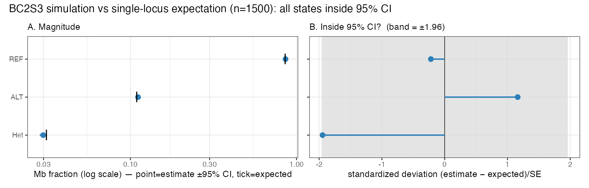

# Genome-fraction vs single-locus BC2S3 expectation — analysis notes

**Date:** 2026-06-17
**Context:** Redo of `molbreeding_vs_skim`. Step 1 = base NIL simulation
(n=1500, MaizeGDB consensus map). Step 2 (this note) = compare the simulated
population's per-sample ALT/Het/REF genome fractions to the single-locus
expectation from the BC2S3 breeding scheme. These notes record the conceptual
design *before* coding, so the comparison is set up correctly.

---

## 1. The single-locus BC2S3 expectation (the baseline)

Pedigree (`R/02_simulate.R::bc2s3_pedigree`): 2 backcrosses + 3 selfings
(F1 → BC1 → BC2 → S1 → S2 → S3, final NIL = id 8).

At any single locus:
- Backcrosses set the donor **allele** frequency: 0.5 → 0.25 → **0.125**;
  selfing does not change allele frequency.
- Het at BC2 = 0.25; three selfings each halve it: 0.25 × (½)³ = **0.03125**.
- From donor dosage 0.125 = P(ALT) + ½·P(Het):

| class | state | single-locus expectation |
|---|---|---|
| REF (hom recurrent) | 0 | 0.859375 |
| Het | 1 | 0.031250 |
| ALT (hom donor) | 2 | 0.109375 |
| donor dosage (ALT + ½·Het) | — | 0.125 |

(0.125 is the dosage the sim already validates against — `R/02_simulate.R:131`,
spec §9.)

---

## 2. Mean genome fraction is INVARIANT to m, the map, and finite n

The single-locus value is a **marginal** quantity. The realized per-sample genome
fraction is `f = (1/G)∫ I(state at x) dx`, so by linearity of expectation / Fubini:

    E[f] = (1/G) ∫ E[I(x)] dx = single-locus value

because the marginal genotype distribution is **identical at every locus** (the
breeding scheme is position-independent). This holds for **any** correlation
structure. Therefore E[f] is invariant to:

- **m (interference)** — interference is purely the *joint* law of crossovers
  across positions; it cannot touch any single-locus marginal.
- **the cM↔bp map shape** — same reason (position-independence of the marginal).
- **finite n** — only adds sampling error around the mean, never bias.

**Consequence:** if the *mean* realized fractions don't land on 0.859 / 0.031 /
0.109 (within sampling error), that's a **simulator bug**, not interference and
not a finite-genome effect.

---

## 2b. The simulation IS the single-locus matrix at the marginal (so the mean check is circular)

The mean-invariance above is actually a corollary of a stronger fact: the Broman
simulation's **single-locus marginal genotype distribution is identical to the
breeding-scheme matrix, exactly, for any m / p / map**. It is the SAME
calculation at that level — not an independent prediction.

**Per-meiosis proof.** simcross builds a gamete by picking a random starting
parental strand (½ each) and flipping origin at each crossover. At a fixed locus
x its founder origin = `start XOR (#crossovers before x is odd)`. Marginalizing
over the crossover process:

    P(origin = A) = ½·P(even # XO before x) + ½·P(odd # XO before x)
                  = ½·(P_even + P_odd) = ½·1 = ½

The crossover-count distribution — hence **m, p, the map** — cancels
(`P_even + P_odd = 1` regardless of spacing). So every meiosis transmits a fair
Bernoulli(½) allele at every locus: exactly the Mendelian segregation the
single-locus transition matrix iterates through BC2S3. Tracking that through the
pedigree reproduces the matrix term-for-term (the whole one-locus *distribution*,
not just its mean).

**But the simulation is a strict superset, not a re-encoding.**
- The matrix computes **one marginal** (genotype law at a point).
- The simulation samples the **full joint multi-locus law** (the whole haplotype
  mosaic). The matrix is the projection of that joint law onto one coordinate.
- The matrix is recoverable from the simulation (marginalize); the simulation is
  NOT recoverable from the matrix (the matrix has zero spatial/joint content).

**Consequence for step 2 — what each check can and cannot show:**

| comparison | what it tests | can it diverge? |
|---|---|---|
| **mean fractions vs matrix** | sampler correctness + n large enough | only via a **bug** or finite-n noise — never via m/biology (it's the same calc) |
| **distribution / variance of `f_i`** | the **joint** structure the matrix cannot represent | **yes** — the only non-circular content; m & finite-genome live here |

So (a) is a **circularity / sanity check**: it must pass, validating that the
simulation is faithfully Mendelian, but it carries no biological information. The
entire reason to simulate rather than iterate the matrix is the multi-locus joint
structure — segment sizes, spatial correlation, across-sample variance — which is
where m and the ergodicity limit enter (next section).

---

## 3. The ergodicity distinction (the conceptual core)

"Converge" means two different things; ergodicity governs only one.

- **Ensemble average:** fix a locus, average over the N independent NILs →
  equals the single-locus value by construction.
- **Spatial average:** fix one NIL, average over its genome → that NIL's `f_i`.

**Ergodicity = the claim that one genome's spatial average ≈ the ensemble
average** (needs *mixing*: correlations decay along the chromosome).

What converges, and what it needs:

| quantity | → single-locus value? | needs ergodicity? | depends on m? |
|---|---|---|---|
| population mean of `f_i` (over N samples) | yes, exactly | **no** — LLN over independent samples | **no** |
| a single `f_i` (one genome) | only approximately | **yes** | yes (variance) |
| spread/variance of `f_i` | — | — | yes (2nd-order) + finite genome (1st-order) |

**Key point:** the population mean uses **ensemble** averaging over 1,500
*independent* NILs, not **spatial** averaging within one genome. So it never
relied on ergodicity. Ergodicity is what you'd invoke if you had *one* genome and
wanted its spatial fraction to proxy the ensemble. We have a real ensemble → the
mean converges by ordinary LLN, m-irrelevant.

This matches the existing framing in `docs/wideseq-coverage-ergodicity.md:18`
("not ergodic in the textbook sense" because of spatial correlation) — same
principle, different observable (there: missingness; here: genotype fraction).

---

## 4. Where finite-genome and m actually show up: the VARIANCE of `f_i`

The per-sample fraction does **not** self-average to the single-locus value, and
that is biology, not error:

1. **Finite genome (dominant, 1st-order).** Each NIL has only ~33 crossovers
   (median 33, `nil_crossovers.csv`) → few spatially-correlated ancestry blocks
   → `f_i` is an average over *few effectively-independent units* → genuinely
   large sample-to-sample variance. Scale is set by **map length**, not m.
2. **m (2nd-order).** At fixed crossover *count* (m=10 and m=0 both give ~33;
   `docs/05`), interference only re-spaces crossovers (fewer tiny / fewer huge
   segments). It reshapes the segment-size distribution → small effect on
   Var(`f_i`); none on the mean.
3. **Finite n (1500).** Sets only the precision of the estimated mean
   (SE ≈ sd/√1500).

"Recombination at each interval independent of the next" = **m = 0** (Poisson).
Independence is *sufficient* for self-averaging but **not necessary** — m=10 is
short-range dependence, still mixing, still self-averages eventually, just at a
different rate (variance).

---

## 5. Comparison design (how to actually run step 2)

Two SEPARATE checks — do not collapse them:

- **(a) Mean fractions vs the BC2S3 matrix** → a *circularity / sanity check*, not
  a discovery. By §2b the simulation's single-locus marginal **is** the matrix, so
  this can only diverge via a bug or finite-n noise. Run it once to confirm the
  sampler is faithfully Mendelian; expect agreement to within ~SE. m-free, map-free.
- **(b) Distribution / variance of per-sample `f_i`** → the *only non-circular*
  comparison; the joint/spatial structure the matrix cannot represent. Where
  finite-genome (big) and m (small) live. Compare the **spread** of m=10 vs m=0
  here, not their means.

**Resolved decisions:**
- **Mb-based (bp-weighted) fractions**, evaluated on **real marker genomic
  coordinates** (each method's own panel), not a synthetic uniform grid — so the
  simulation is comparable to "the marker data you can collect." For the f_i
  check, conversion is **bp→cM** (to look up the simulated state at each marker);
  Mb is read straight off the bp positions. **No cM→Mb step.**
- **cM↔bp uses a Hyman-filtered monotone cubic spline (`splinefun(method="hyman")`),
  both directions** (`make_bp_to_cm`, `make_cm_to_bp`), on the `enforce_monotone`
  anchors. Why: (i) linear ramps are crude in the inverse cM→bp direction inside
  recombination-cold regions (dx/dy up to ~40 Mb/cM — see 5b); (ii) `monoH.FC`
  overshoots by ~1e-3 at flat→rising transitions, so it is NOT strictly monotone
  on this map — Hyman is (min step 0 on all 10 chr, verified) and errors on
  non-monotone input (a guard that `enforce_monotone` ran). Monotonicity comes
  from `enforce_monotone` (cummax drop-filter, R/01) upstream; the spline only
  preserves it. For bp→cM the cold-region cM range per gap is tiny, so spline≈
  linear there; the spline earns its keep in cM→bp.
- Starting **m = 10** (Broman/simcross default). Data-driven m estimable later
  from **GBTS** crossover spacing — NOT from the consensus cM map. See
  `14-interference-and-rigidity.md`.

Implemented in `check_broman_single_locus.R`.

---

## 5b. "Does the map matter?" — split the verb (mean vs variance)

Recurring confusion: with a huge recombination-cold centromere (big in Mb, small
in cM) carrying most evenly-spaced markers, surely the map matters for what you
measure? **It matters for the variance, not the mean.**

- **Mean (p₀):** every marker — even one in the dead centromere — has marginal
  P(ALT)=0.109375, because backcross+selfing act on each locus identically
  regardless of recombination. Recombination changes *correlation between* loci,
  never the *marginal at* a locus. So `E[fraction] = average of equal marginals =
  p₀` for ANY panel / map. **Map-invariant. Ascertainment cannot bias the mean.**
- **Variance / effective N:** cold-region markers are highly correlated (a whole
  block shares one ancestry state per individual), so they are mostly redundant.
  Extreme case (one dead centromere = one block): per-sample fraction ≈
  Bernoulli(0.109) → SD ≈ 0.31, bimodal, nowhere near concentrated at p₀ — yet
  its mean is still p₀.

**Quantitative confirmation (N=60 smoke test, real maize map, 8000 markers):**
ALT `sd_fi = 0.0624` ⇒ `N_eff = p(1−p)/sd² ≈ 0.0974/0.0624² ≈ 25` effective
independent blocks — NOT 8000 markers, ≈ the crossover count. A naive per-marker
binomial would claim SD ≈ 0.0035 (wrong by ~18×). **This is why all f_i inference
uses `SE = sd(f_i)/√N_samples`, never per-marker binomial / Pearson.**

Upshot: the estimate is **unbiased** (map-free center) but its **precision is
map-dominated** (N_eff ≈ #recombination blocks, not #markers). Bias ≠ variance.
Different methods have different panels, so they share the unbiased center but
differ in variance — which is why layer-3 comparisons must use each method's own
marker coordinates.

---

## 5c. The three f_i and the bias decomposition (why the simulation is needed)

The real goal is a *sanity check of the ancestry designation*: does it match the
single-locus model? But the naive check (real vs p₀) is **confounded by method
bias**. There are THREE f_i per method:

| | f_i source | carries |
|---|---|---|
| **(1) p₀** | single-locus BC2S3 matrix | neutral breeding expectation (map-free) |
| **(2) degraded-sim f_i** | sim truth → this method's observation model → its caller | **method bias only** (truth is known-neutral) |
| **(3) real-data f_i** | the ancestry designation on real samples | method bias **+** real biology |

Decomposition:

    (3) − (1) = total observed deviation     ← what a naive sanity check sees
    (2) − (1) = method bias                   ← simulation isolates this
    (3) − (2) = real biological deviation     ← seg. distortion / selection / contamination

**So the correct reference for real f̂_i is (2), the degraded-sim — NOT p₀.**
Example: the 0.4× skim under-calls het (one read makes a het look homozygous), so
skim f̂_Het < 0.031 *even when the caller works perfectly*. Comparing skim to p₀
directly would wrongly flag a correct method. For high-coverage GBTS, (2) ≈ (1),
so real-vs-p₀ is fine there; for the skim it is not.

This is the operational meaning of **"is the simulation a realistic baseline?"**:
it is realistic to the extent that (2) reproduces what the method does to real
data (validated by the missingness/depth/segment comparisons below). Once (2) is
trustworthy it becomes the **bias-calibrated yardstick** for (3).

Sanity check upgrades from *"does ancestry match the single-locus model?"* to
*"does ancestry, minus its method bias, match neutral breeding?"* — the question
actually wanted, and only the simulation supplies the bias term.

---

## 5d. Validation framework — one truth, N observation models

```
breeding scheme (BC2S3) + map + m  ─►  TRUTH (continuous mosaic per NIL)
         ├─ skim panel + λ,π,k + error + RTIGER(r) ─► observed segments
         ├─ GBTS panel + λ,π,k        + RTIGER(r) ─► observed segments
         └─ wideseq / BRBseq / ...                 ─► observed segments
```

Realism = **(truth correct)** × **(each observation model fit to its dataset and
reproducing it)**. Three validation layers:

| layer | check | reference | status / tooling |
|---|---|---|---|
| **1 Truth** | f_i mean=p₀; f_i variance/N_eff; **true** segment-size dist (Mb & cM) | mean: matrix (circularity). variance & sizes: predictions of (map+m), judged vs real after degradation | `check_broman_single_locus.R`; `nil_segments.csv`/`docs/04` |
| **2 Observation (per method)** | missingness %, depth dist, het under-call | the **real** dataset (exp-floor π,k are fit to it) | `make_*_benchmark.R` + `draw_allele_counts`; ``snp50k-coverage-model`` |
| **3 Recovery (per method)** | truth→called: segment-size dist, fragmentation, donor-fraction bias, missed/false | the sim truth (known exactly) | `R/06_score_rtiger.R` |

Key: f_i variance and the segment-size distribution are **not** validated by the
matrix (it has no spatial content) — they are outputs of (map+m), trusted only
once layers 2–3 show the degraded sim reproduces the **real** data. Residual
beyond that = the separate hypothesis-testing signal (real deviation from
neutral breeding).

Most machinery already exists (the `make_*_benchmark.R` observation models +
`06_score` recovery). The work is assembling validation *views*, not new sim code.

---

## 7. Empirical results (layer 1, n = 1500)

Run with `check_broman_single_locus.R`, `sweep_marker_density.R`, and
`run_all.R --sim` (n_nil = 1500). All numbers are the simulation truth; no
genotyping method involved.

### 7.1 f_i validation — PASS

At n = 1500 (20k-marker grid) all three Mb fractions sit inside their 95 % Wald CIs:

| state | expected p₀ | estimate | 95 % CI | in CI |
|---|---|---|---|---|
| REF | 0.859375 | 0.85900 | [0.8557, 0.8623] | ✓ |
| Het | 0.031250 | 0.02985 | [0.0284, 0.0313] | ✓ |
| ALT | 0.109375 | 0.11115 | [0.1082, 0.1141] | ✓ |

Hotelling/Wald χ²(2) T² = 5.21 (p = 0.074) — borderline, but driven by the
marker-resolution undercount of Het (§7.2), not Mendelian error. **N_eff(ALT) ≈ 28
vs 20 000 markers** confirms the ergodicity-limited effective sample size (§5b).



*Two panels because the fractions span ~2 orders of magnitude: (A) log axis for
magnitude, (B) standardized deviation (estimate−expected)/SE with ±1.96 band for
the pass criterion (§5b).*

### 7.2 Marker-resolution sweep (N = 1500, 5 reps)

Cohen's d = (mean − expected)/SD (N-independent effect size); z = d·√N (reported,
but N-inflated — judge by d). Controlled design: the **same** NILs re-measured on
every grid, replicated 5× for SE. (`marker_sweep_summary.csv`.)

| markers | spacing | Het est | **Het d ± SE** | Het z | ALT d | REF d |
|---|---|---|---|---|---|---|
| 1,000 | 2.12 Mb | 0.0279 | **−0.122 ± 0.004** | −4.72 | −0.096 | +0.137 |
| 2,000 | 1.06 Mb | 0.0293 | −0.068 ± 0.004 | −2.65 | −0.055 | +0.078 |
| 4,000 | 0.53 Mb | 0.0301 | −0.040 ± 0.004 | −1.53 | −0.033 | +0.046 |
| 8,000 | 0.27 Mb | 0.0306 | −0.024 ± 0.004 | −0.95 | −0.023 | +0.030 |
| 20,000 | 0.11 Mb | 0.0308 | −0.015 ± 0.004 | −0.59 | −0.016 | +0.021 |
| 50,000 | 0.04 Mb | 0.0309 | −0.012 ± 0.004 | −0.45 | −0.013 | +0.017 |
| 100,000 | 0.02 Mb | 0.0310 | −0.010 ± 0.004 | −0.40 | −0.012 | +0.015 |
| 200,000 | 0.01 Mb | 0.0310 | −0.010 ± 0.004 | −0.37 | −0.012 | +0.015 |

**Het is monotonically *undercounted* at every density** (d < 0), relaxing toward
a small residual plateau (d ≈ −0.010, Het 0.0310 vs 0.03125 — ~1 %). It never
crosses or overshoots p₀. Mechanism: sparse grids miss small Het segments (a Het
run < marker spacing gets ~0 markers → 0 Mb via the last−first span; Het is the
smallest/rarest state, so it loses most; ALT/REF mirror it). The residual at high
density is a measurement artifact (run span loses each Het run's flanking gaps),
fixable with territory-based Mb; negligible in effect size.

**Significance is N-driven and sparse-grid-driven, not Mendelian:** |z| > 1.96
only at ≤ 2 000 markers (≥ ~1 Mb spacing). By 4 000 (~0.5 Mb) z = −1.5; beyond
that the deviation is negligible (|d| ≈ 0.01) but z stays small *only because* d
is small — at finer effect sizes large N would still inflate z (cf. §2b, the
large-N GOF pathology).

> An earlier single N = 600 run suggested Het *crossed* p₀ and overshot to
> d ≈ +0.03. That was pure realization noise — SE(d) ≈ 1/√600 ≈ 0.04 swamps the
> signal. The replicated N = 1500 result (SE ± 0.004) overturns it: monotone
> undercount, no crossing. Lesson: assert effect-size trends only with replication.

**Practical floor:** ≳ 4 000 markers (~0.5 Mb spacing) to measure Het faithfully.
This is the *truth-measurement* floor; the skim's separate problem is low-coverage
Het *miscalling* (layer 2), a different mechanism.

### 7.3 Introgression run-length distribution → simulation notebook

The continuous nonref (donor-union) introgression segment-size distribution (Mb)
and the m=10 vs m=0 interference comparison are produced and shown in the
**simulation notebook** `nil_introgression_1500.qmd` (§4 — size distribution +
interference sensitivity; `nil_segments.csv`, `introgression_size.png`), not here
(separation of concerns: that is simulation truth, this doc is the *fraction*
validation). Summary: median ~11 Mb, heavily right-skewed (90th ~94 Mb), dosage 0.125.

- **Baseline takeaway:** the small-segment left tail (≲5 Mb), combined with the
  ~0.5 Mb truth-resolution floor (§7.2) and per-method coverage, is the population
  methods will under-recover. This distribution is the denominator for
  "what's recoverable" in layers 2–3.

---

## 6. Cross-refs

- BC2S3 pedigree + sim: `R/02_simulate.R`; driver `run_all.R` (set
  `n_nil = 1500L` at `run_all.R:22`).
- The f_i check (Hotelling, Mb-based, real-panel-capable):
  `check_broman_single_locus.R`.
- cM↔bp conversion: `R/03_segments_to_mb.R` (`make_cm_to_bp`, cM→bp) /
  `R/05_make_rtiger_input.R` (`make_bp_to_cm`, bp→cM) — both Hyman monotone
  splines (`splinefun(method="hyman")`); monotonicity enforced upstream by
  `enforce_monotone` (`R/01_compile_map.R`, cummax drop-filter, verified 0 cM
  inversions on all 10 chr).
- Observation models (layer 2): `make_rtiger_benchmark.R`,
  `make_45k_array_benchmark.R`, `make_wideseq_benchmark.R`, `make_joint_benchmark.R`;
  coverage/missingness ``snp50k-coverage-model``.
- Recovery scoring (layer 3): `R/06_score_rtiger.R`.
- Real marker panels: skim `data/rtiger_50K/...`; GBTS
  `data/molbreeding_45k/sites_v5_SNP.tsv` (44,455 sites, v5 bp).
- CO counts: `results/nil_crossovers.csv`, `docs/05-crossovers.md` (median 33).
- Existing ergodicity treatment (coverage model): `docs/wideseq-coverage-ergodicity.md`.
- m vs true rigidity r relationship: see `14-interference-and-rigidity.md`
  (companion note).